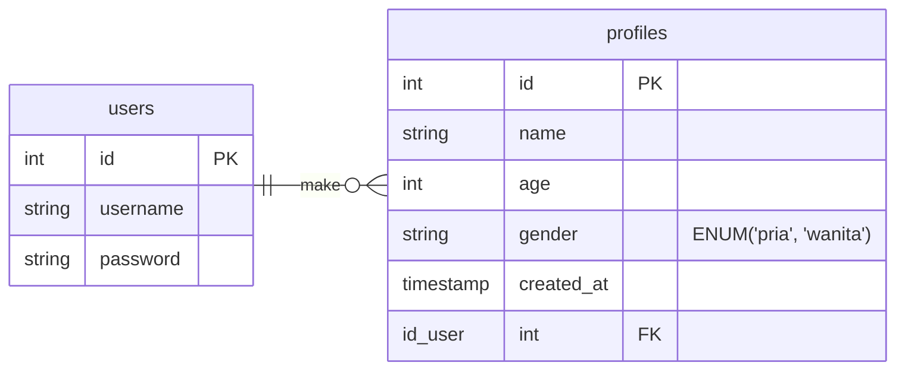

## ERD CLI Biodata

```mermaid
  erDiagram
  direction LR
  users ||--o{ profiles : make

  profiles {
    int id PK
    string name
    int age
    string gender "ENUM('pria', 'wanita')"
    timestamp created_at
    id_user int FK
  }
  users {
    int id PK
    string username
    string password
  }

```
